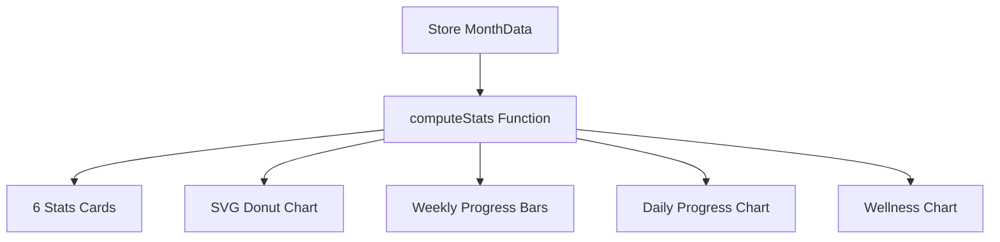

# Habits Module UI Specification

This document provides a comprehensive UI specification for recreating the web application's Habits module in a React Native mobile application, targeting 95–100% visual and behavioral parity.

---

## 1. Screen Architecture

### Complete Layout Hierarchy
- **Screen Container**: Full-viewport flex container (`h-screen w-screen flex flex-col`) with dynamic viewport height protection (`100dvh`) on mobile devices.
- **Top Navigation & Info Header (`header`)**: Anchored layout (approx. 44px height) containing month selectors, global sync indicators, streak metrics, theme togglers, and dashboard customization menus.
- **Statistics Panel Grid (`div.grid`)**: A horizontal row immediately under the header, displaying 6 key performance cards.
- **Main Working Grid (`div.grid-cols-12`)**:
  - **Habits Management Sidebar (Col-12 to LG Col-2)**: Left sidebar containing the active habits catalog list, emoji pickers, and habit insertion components.
  - **Tracker Calendar Table (Col-12 to LG Col-7)**: Center table displaying a grid of days (1–31) on the X-axis and habits on the Y-axis.
  - **Overall Progress Donut + Weekly Progress Bars (Col-12 to LG Col-3)**: Right column containing circular and bar charts tracking consistency.
- **Visual Analytics Area (Row-3)**:
  - **Daily Progress Graph (Col-12 to MD Col-6 to LG Col-4)**: Bar or Line chart displaying daily completions.
  - **Analysis Metrics Table (Col-12 to MD Col-6 to LG Col-4)**: List showing habit-by-habit goal percentages.
  - **Wellness Analytics & Today's Logs (Col-12 to LG Col-4)**: Combo box showing mood and sleep charts alongside sliders and notes for today's logs.

### Component Tree
```
Dashboard (Page Container)
├── Header Component
│   ├── Navigation Cycling Button (Back to Matrix)
│   ├── Month Navigator (Chevron Left / Select Year / Select Month / Chevron Right)
│   ├── SyncStatusIndicator
│   ├── Streak Counter Badge (Flame Icon)
│   ├── Points Counter Badge (Zap Icon)
│   ├── Theme Toggle Switch (Sun / Moon)
│   └── Dashboard Settings Popover (Accent Color, Card Size, Chart Type)
├── Stats Overview Grid
│   └── 6 x Stat Cards (Goal, Completed, Left, Overall %, Today %, Consistency)
└── Main Dashboard Grid
    ├── Habits Catalog Sidebar
    │   ├── Habits List Rows
    │   │   └── Habit Row Item (Emoji, Name, Move, Sync Config, Edit, Delete Actions)
    │   └── Habit Creation Form (Emoji suggestions, custom Emoji input, Text input, Submit button)
    ├── Tracker Table Grid (Calendar Matrix)
    │   └── Table Wrapper (Sticky headers, sticky left-hand column, checkbox cells)
    └── Progress Summary Panel
        ├── Overall Progress Panel (Donut Component + Mini Metrics Grid)
        └── Weekly Progress Panel (5 x Vertical bar metrics W1–W5)
    ├── Daily Progress Graph Panel (BarChart / LineChart Toggle)
    ├── Analysis Table Panel (Habits Progress Slider Bars list)
    └── Wellness Reflection Panel
        ├── Wellness Graph (Mood and Sleep dual line graph)
        └── Today's Log Input Area (Mood Selectors, Sleep hours slider, Notes TextArea)
```

### Section Order (Mobile Stack Flow)
When viewed on screens under 1024px (`lg`), the horizontal grid collapses into a vertical scrollable column in the following sequence:
1. Brand Navigation Header
2. Stats Overview Cards
3. Tracker Calendar Panel (horizontal scrollable)
4. Habits Catalog Sidebar
5. Progress Summary Panels (Overall & Weekly)
6. Daily Progress Graph
7. Analysis Table
8. Wellness Graph & Today's Log Input Area

---

## 2. Visual Design

### Colors
- **Canvas Base Background**:
  - Dark Mode: `oklch(0.16 0.005 260)` (deep charcoal-black)
  - Light Mode: `oklch(0.99 0.003 260)` (off-white)
- **Panel / Card Container Background**:
  - Uniform across themes: `oklch(0.20 0.006 260)` (dark slate)
- **Borders & Dividers**: `rgba(255, 255, 255, 0.1)` (`border-white/10`)
- **Accent Color Palette**: Selected dynamically from settings popover:
  - **Blue**: `oklch(0.65 0.18 250)`
  - **Green** (Default): `oklch(0.76 0.17 158)`
  - **Purple**: `oklch(0.68 0.18 290)`
  - **Orange**: `oklch(0.74 0.18 55)`
  - **Red**: `oklch(0.65 0.22 25)`
  - **Pink**: `oklch(0.70 0.22 340)`

### Typography
- **Font Family**: `Geist, ui-sans-serif, system-ui, sans-serif`.
- **Text Casing**: Subtitles and panel header titles use uppercase with letter spacing: `text-[10px] uppercase tracking-widest text-white/50`.

### Font Sizes & Dimensions (Based on Card Size Settings)
The font sizes, paddings, and card gaps adjust dynamically based on the selected configuration:

| Property | Small Settings | Medium (Default) | Large Settings |
| :--- | :--- | :--- | :--- |
| **`--font-base`** | `11px` | `13px` | `15px` |
| **`--card-padding`** | `0.5rem` (8px) | `0.75rem` (12px) | `1.0rem` (16px) |
| **`--card-gap`** | `0.375rem` (6px) | `0.5rem` (8px) | `0.75rem` (12px) |
| **`--stat-val-size`** | `1.125rem` (18px) | `1.25rem` (20px) | `1.5rem` (24px) |
| **`--donut-size`** | `85px` | `110px` | `130px` |

### Border Radius
- **Outer Panel Containers**: `rounded-lg` (14px).
- **Buttons, Inputs, Dialog content**: `rounded-md` (12px).
- **Checkboxes, Badges**: `rounded-sm` (10px) or `rounded` (4px).

### Shadows
- **Weekly Progress Bars Glow**: `box-shadow: 0 0 10px -3px var(--dashboard-accent)`.
- **Tracker Checkboxes (Checked)**: `box-shadow: 0 0 8px -2px color-mix(in oklab, var(--dashboard-accent) 70%, transparent)`.
- **Dialog & Settings Popovers**: `shadow-xl`.

### Calendar Grid Dimensions
- **Left Column (Habit Name)**: Sticky header with a minimum width of `140px` (`min-w-[140px]`).
- **Date Columns (Days 1–31)**: Fixed column width of `24px` (`w-6`).

---

## 3. Calendar Layout

- **Grid Structure**: Scrollable table format using a standard `table` component with `border-separate border-spacing-0`.
- **Sticky Components**:
  - Header Row (`thead`): Sticky top.
  - Habit Column (`td` - First column): Sticky left-aligned, ensuring habit names remain visible when scrolling horizontally.
- **Cell Size**: Fixed column width (`w-6` / 24px) for day columns. Cell padding is computed as `calc(var(--card-padding) * 0.3)` vertically.
- **Interactive Checkboxes**: Renders a customizable square button (`h-4 w-4 rounded`):
  - **Checked (Completed)**: Solid background matching the active accent color, white check icon (`Check` from Lucide, `h-2.5 w-2.5`), and a matching glow shadow.
  - **Unchecked**: Translucent background (`bg-white/[0.03]`), border (`border-white/10`), and an interactive hover border that updates to the accent color (`hover:border-[var(--dashboard-accent)]`).
- **Today's Column Highlight**:
  - Highlights today's date column with a translucent overlay: `backgroundColor: color-mix(in oklab, var(--dashboard-accent) 6%, transparent)`.
  - Today's date column header number changes color to `var(--dashboard-accent)`.
- **Empty Cells**: Rendered as unchecked checkbox indicators.

---

## 4. Habit Cards (in Sidebar)

- **Layout Structure**: Flex row (`flex items-center gap-1.5 rounded-md px-1.5 py-1 hover:bg-white/5`).
- **Emoji Indicator**: Renders in a fixed-width container on the left (`w-5 text-center text-base`).
- **Habit Title**: Centered text, set to truncate (`truncate text-xs`) if it exceeds the available space.
- **Hover Action Buttons (Desktop only)**:
  - Flex container aligning item buttons (`gap-0.5 text-white/50 opacity-0 group-hover:opacity-100`):
    - **Sync Config (`RefreshCw`)**: Syncs with Matrix. Highlights with the accent color if active.
    - **Move Up (`ArrowUp`)** / **Move Down (`ArrowDown`)**: Rearranges habit order.
    - **Edit (`Pencil`)**: Opens inline editing fields.
    - **Delete (`Trash2`)**: Deletes the habit. Highlights red on hover.
- **Editing Mode**:
  - Toggling edit mode replaces the title and emoji with inline input boxes:
    - Emoji input: `w-7 text-center rounded border bg-white/5`.
    - Text input: `flex-1 bg-transparent border-b outline-none text-xs`.
    - Confirmation Action: Check icon (`Check`) saves modifications on press.

---

## 5. Statistics Section

### Overview Metric Cards (6 Cards)
1. **Goal**: Calculates total targets for the month: `habits.length * daysInMonth`.
2. **Completed**: Total number of checks recorded.
3. **Left**: Goal minus completed checks.
4. **Overall %**: Percentage rate: `(Completed / Goal) * 100`.
5. **Today %**: Progress percentage for today's habits.
6. **Consistency**: Percentage of days in the month with at least one habit completed.

### Progress Visualizations



- **Donut Chart (Overall Progress)**:
  - Custom SVG element using circle components (radius `42`, stroke width `8`, circumference `263.89`).
  - Active circle path uses standard SVG `strokeDasharray` math to calculate progress based on overall completion percentage.
  - Applied filter standard: `<feGaussianBlur stdDeviation="1.5" />` to generate glowing effects around active progress arcs.
- **Weekly Progress Bars**:
  - Horizontal stack of 5 bars representing W1–W5.
  - Heights are set dynamically using percentage values (`height: ${Math.max(4, weekPct)}%`).
  - Includes a glowing shadow effect matching the accent color.
- **Progress Charts**:
  - Uses Recharts to render responsive containers for daily metrics (Bar/Line graphs) and wellness metrics (sleep line graph + mood line graph).

---

## 6. Interactions

- **Completions**: Tapping a square in the tracker calendar grid toggles that habit's check state.
- **Inline Editing**:
  - Double-clicking habit titles or tapping the pencil icon toggles edit mode.
  - Commits edits when the check button is pressed or when the user presses `Enter`.
  - Pressing `Escape` cancels edits.
- **Daily Reflection Controls**:
  - Tapping a mood emoji (😞, 😕, 😐, 🙂, 😄) updates mood values.
  - Adjusting the slider updates sleep metrics in real-time.
  - Typing in the notes box saves reflections to the store.
- **Sidebar Actions (Desktop Hover)**: Tapping or hovering reveals edit, delete, reorder, and sync options.

---

## 7. Theme

- **Mode Switching**: Toggles the `.light` class on the page wrapper container.
- **Color Variables**:
  - Dark Mode background: `oklch(0.16 0.005 260)`.
  - Light Mode background: `oklch(0.99 0.003 260)`.
  - Panel box colors remain consistent (`oklch(0.20 0.006 260)`) to maintain container boundaries across themes.
- **Workspace Syncing**: Syncing settings globally modifies the layout. For example, switching to the personal workspace changes the matrix to softer pastel colors.

---

## 8. Mobile Adaptation Notes

| Desktop Feature | Mobile Adaptation Strategy | Rationale |
| :--- | :--- | :--- |
| **Grid Analytics Row 3** | Stack vertically in a scroll view. | Prevents horizontal squishing on small mobile displays. |
| **Horizontal Grid Table** | Wrap in a horizontal ScrollView or replace with a swipeable list. | Fits the multi-column layout within mobile screen widths. |
| **Hover Action Overlays** | Show actions by default or move them to swipeable row menus. | Touch screens do not support hover states. |
| **Recharts SVG Graphs** | Rebuild with `react-native-svg` and `react-native-chart-kit`. | Recharts is a web-only library. |
| **Radix UI Popovers** | Rebuild using Native Modals or Bottom Sheets. | Provides a native mobile feel and handles screen overlays correctly. |
| **Slider range selector**| Rebuild using `@react-native-community/slider`. | Native range sliders look and perform better on mobile. |

---

## 9. React Native Mapping

- **Flexbox Grid**: Recreate CSS Grid rows using standard nested Flexbox View wrappers.
- **Custom SVG Donut**: Recreate using `react-native-svg`:
  ```javascript
  import Svg, { Circle, Defs, Filter, FeGaussianBlur } from 'react-native-svg';
  // Render Circle with strokeDasharray and strokeDashoffset
  ```
- **Horizontal Scrolling**: Recreate the calendar matrix grid using `ScrollView` with `horizontal={true}`.
- **Typography & Font weights**: Use React Native `<Text>` components with specific styles (`fontFamily`, `fontSize`, `fontWeight`).

---

## 10. Components Used

1. `Dashboard` (Main container page)
2. `Panel` (Bordered container card)
3. `Stat` (Metrics overview block)
4. `MiniStat` (Compact stats display block)
5. `Donut` (Custom SVG progress circle)
6. `SyncStatusIndicator` (Sync details popover)
7. `RecurringConfigDialog` (Modal handling recurrence details)

---

## 11. Assets

- **Icons**: Lucide Lucide Icons (`ArrowLeft`, `Plus`, `Pencil`, `Trash2`, `ArrowUp`, `ArrowDown`, `Check`, `Flame`, `Zap`, `Moon`, `Sun`, `Settings`, `ChevronLeft`, `ChevronRight`, `RefreshCw`, `Cloud`, `CloudOff`, `CloudLightning`, `CheckCircle2`).
- **Audio Sound Effects**:
  - `playWorkEndSound()`
  - `playBreakEndSound()`
- **Fonts**: Custom Geist font asset bundles.

---

## 12. Final Checklist for Visual Parity

- [ ] Canvas background changes based on theme: `oklch(0.16 0.005 260)` (dark) or `oklch(0.99 0.003 260)` (light).
- [ ] Panel cards use the background color `oklch(0.20 0.006 260)` in both modes, separated by a thin 1px border.
- [ ] Checkboxes use the selected accent color and display a white checkmark when completed.
- [ ] The current date column is highlighted with a 6% opacity overlay of the selected accent color.
- [ ] Overall progress is visualized using a custom SVG donut chart with a subtle study glow shadow.
- [ ] Weekly progress is shown using vertical progress bars with heights matching weekly completion rates.
- [ ] Daily progress and wellness charts match the colors and layout of the web charts.
- [ ] Today's log reflection elements (mood emoji selectors, sleep sliders, notes) match the layout of the web panel.
