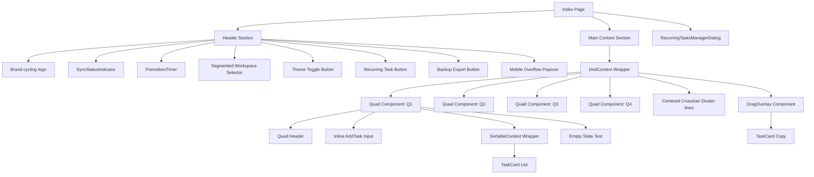

# Eisenhower Matrix UI Specification

This document provides a comprehensive UI specification for recreating the web application's Eisenhower Matrix screen in a React Native mobile application, specifically optimized for Android while retaining visual parity with the desktop website experience.

---

## 1. Overall Layout Hierarchy

- **Root Wrapper Container (`div.h-screen`)**:
  - Full-screen height (`100vh` on desktop, `100dvh` on mobile web) and full-screen width (`100vw`).
  - Vertical Flexbox layout (`flex flex-col`).
  - Background color maps to the theme (`var(--background)`).
- **Header Navigation Bar (`header`)**:
  - Horizontal Flexbox layout (`flex items-center`).
  - Anchored at the top, fixed height, with a border-bottom separating it from the content.
  - Backdrop blur filter (`backdrop-blur-sm`) and translucent background (`bg-card/60`).
- **Main Content Area (`main`)**:
  - Dynamic viewport height filler (`flex-1`).
  - Desktop: Grid layout with overflow hidden (`overflow-hidden`).
  - Mobile: Vertical scrollable flow (`overflow-y-auto`).
- **Matrix Grid (`div.grid`)**:
  - Responsive Grid layout (`grid` with `grid-cols-1` on mobile and `md:grid-cols-2 md:grid-rows-2 h-full` on desktop).
  - Divides into four quadrant sections.
- **Divider Overlay System (`div.pointer-events-none`)**:
  - Hidden on mobile (`hidden`), visible on desktop (`md:block`).
  - Positioned absolutely inside the main content area (`absolute inset-0`).
  - Contains two lines:
    - Horizontal divider: `absolute left-0 right-0 top-1/2 h-px bg-border`.
    - Vertical divider: `absolute top-0 bottom-0 left-1/2 w-px bg-border`.

---

## 2. Component Hierarchy



---

## 3. Every React Component Used

1. **`Index`**: The main page component orchestrating context bindings, state, and layouts.
2. **`Quad`**: Individual quadrants containing specific logic for adding new tasks, dropping dragged tasks, list headers, and rendering children.
3. **`TaskCard`**: Component that renders an individual task with layout flags, editing modes, deadline indicators, deletion buttons, and touch indicators.
4. **`WorkspaceSwitcher`**: Dropdown popup containing workspace filters (Personal, Professional, Both).
5. **`PomodoroTimer`**: Compact header dashboard widget handling timer count, audio chimes, work/break toggles, and settings popover.
6. **`SyncStatusIndicator`**: Header status button indicating if the cloud database is loaded, saving, synced, offline, or failed.
7. **`RecurringTasksManagerDialog`**: Dialog window handling recursive configuration list view and task details modifications.
8. **Radix UI/Shadcn Primitives**:
   - `Popover`, `PopoverTrigger`, `PopoverContent` (Deadlines, settings, mobile menus)
   - `Dialog` structure (Manager Dialogs)
   - `Checkbox` (Task completion toggling)
   - `Input` (Text edits and task insertions)

---

## 4. CSS Structure

- **Tailwind Utility Layers**: Uses Tailwind CSS `@tailwind base`, `@tailwind components`, and `@tailwind utilities`.
- **CSS Variables**: Core tokens are defined in HSL/OKLCH color formats inside `@layer base` in `src/index.css`.
- **Theme Variables**: Under `.dark` and standard `:root` classes.
- **Dynamic CSS Classes**:
  - `shadow-card`: Card shadows using HSL opacity settings.
  - `shadow-float`: Glossy floating shadow for popups.
  - `task-dragging`: Added to the overlay target (`opacity-50 rotate-2 scale-105`).
- **Workspace Modifier**: Custom variables are applied depending on root tags (e.g. `:root.workspace-personal` changes quadrant backgrounds to soft pink, lavender, peach, and tealish green).
- **Accent Color Overrides**: Inline styles are overridden globally when users click and update accent colors (e.g., `accent-green`, `accent-purple` override `--primary` and `--ring`).

---

## 5. Colors

The app uses standard design tokens that dynamically switch between Light and Dark mode.

### Theme Colors (HSL Values)

| Variable | Light Mode (Default) | Dark Mode | Description |
| :--- | :--- | :--- | :--- |
| `--background` | `40 33% 97%` (warm cream) | `224 30% 8%` (dark slate-black) | Entire application canvas background |
| `--foreground` | `220 30% 18%` (charcoal) | `220 15% 92%` (off-white) | Base text colors |
| `--card` | `0 0% 100%` (white) | `224 25% 12%` (deep slate-blue) | Task cards and dialog containers |
| `--card-foreground`| Matches `--foreground` | Matches `--foreground` | Text on card components |
| `--muted` | `220 20% 95%` (grey) | `224 20% 16%` (dark grey) | Secondary background panels |
| `--muted-foreground`| `220 12% 48%` | `220 12% 62%` | Subtitles and disabled tags |
| `--border` | `220 20% 90%` | `224 20% 20%` | Inline layout divider borders |
| `--primary` | `220 60% 50%` | `220 80% 65%` | Primary focus elements |

### Accent Colors (Hex & OKLCH Equivalents)
Accents override the `--primary` and `--ring` variables.

- **Blue**: `oklch(0.65 0.18 250)`
- **Green**: Light: `150 60% 42%` | Dark: `150 65% 55%`
- **Purple**: Light: `265 60% 55%` | Dark: `265 70% 68%`
- **Orange**: Light: `25 90% 55%` | Dark: `25 90% 62%`
- **Red**: Light: `0 75% 55%` | Dark: `0 75% 62%`

### Quadrant Color Mappings

Quadrants use HSL hues at 40% background opacity (`bg-[color]/40`).

#### 1. Professional / Default Workspace
- **Q1 (Do - Coral)**:
  - Light Mode: BG HSL `8, 80%, 88%` | FG HSL `8, 60%, 32%`
  - Dark Mode: BG HSL `8, 45%, 24%` | FG HSL `8, 80%, 82%`
- **Q2 (Schedule - Sky Blue)**:
  - Light Mode: BG HSL `200, 70%, 88%` | FG HSL `200, 60%, 28%`
  - Dark Mode: BG HSL `200, 45%, 22%` | FG HSL `200, 75%, 82%`
- **Q3 (Delegate - Amber)**:
  - Light Mode: BG HSL `45, 85%, 86%` | FG HSL `35, 65%, 30%`
  - Dark Mode: BG HSL `38, 45%, 22%` | FG HSL `45, 85%, 80%`
- **Q4 (Delete - Sage)**:
  - Light Mode: BG HSL `140, 45%, 86%` | FG HSL `140, 40%, 25%`
  - Dark Mode: BG HSL `140, 30%, 20%` | FG HSL `140, 50%, 80%`

#### 2. Personal Workspace Overrides (`workspace-personal`)
- **Q1 (Pink)**:
  - Light Mode: BG HSL `340, 55%, 92%` | FG HSL `340, 50%, 35%`
  - Dark Mode: BG HSL `340, 30%, 22%` | FG HSL `340, 60%, 82%`
- **Q2 (Lavender)**:
  - Light Mode: BG HSL `260, 45%, 92%` | FG HSL `260, 45%, 35%`
  - Dark Mode: BG HSL `260, 25%, 22%` | FG HSL `260, 55%, 82%`
- **Q3 (Peach)**:
  - Light Mode: BG HSL `30, 60%, 92%` | FG HSL `30, 55%, 32%`
  - Dark Mode: BG HSL `30, 35%, 20%` | FG HSL `30, 70%, 80%`
- **Q4 (Tealish Green)**:
  - Light Mode: BG HSL `160, 35%, 90%` | FG HSL `160, 40%, 28%`
  - Dark Mode: BG HSL `160, 20%, 18%` | FG HSL `160, 45%, 80%`

### Task Card Dynamic Styles

- **Low Priority**: `bg-green-50 border-green-200 dark:bg-green-950/50 dark:border-green-900/60`
- **Medium Priority**: `bg-yellow-50 border-yellow-200 dark:bg-yellow-950/50 dark:border-yellow-900/60`
- **High Priority**: `bg-red-50 border-red-200 dark:bg-red-950/50 dark:border-red-900/60`
- **Completed**: `bg-zinc-100 border-zinc-200 dark:bg-zinc-950/60 dark:border-zinc-900`
- **Overdue**: `bg-red-50 border-red-200 dark:bg-red-950/40 dark:border-red-900/60`

---

## 6. Borders

- **Dividers**: `1px` absolute horizontal/vertical lines (`bg-border` / HSL `var(--border)`).
- **Header Border**: `1px` bottom border (`border-b border-border`).
- **Task Cards**: `1px` solid outline border representing priority or completion states.
- **Buttons**:
  - Regular buttons: `1px border border-border/60 bg-card/70`.
  - Add Task Button (in Quad Header): `1px border border-border/50 bg-card/60`.
- **Overlay ring**: Droppable hover overlays apply a `ring-2 ring-inset ring-[q1|q2|q3|q4]`.

---

## 7. Shadows

- **Card Shadow (`--shadow-card`)**:
  - Light Mode: `0 1px 2px hsl(220 30% 18% / 0.04), 0 8px 24px -8px hsl(220 30% 18% / 0.08)`.
  - Dark Mode: `0 1px 2px hsl(0 0% 0% / 0.4), 0 8px 24px -8px hsl(0 0% 0% / 0.5)`.
- **Floating Popovers (`--shadow-float`)**:
  - Light Mode: `0 10px 30px -10px hsl(220 60% 50% / 0.45)`.
  - Dark Mode: `0 10px 30px -10px hsl(220 80% 65% / 0.55)`.
- **Task Card Hover**: Applied as utility `.hover:shadow-md`.
- **Drag Target Overlay shadow**: Strong floating depth (`shadow-md`).

---

## 8. Border Radius

- **System Radius Token (`--radius`)**: `0.875rem` (14px).
- **Outer Layout Elements**: `rounded-lg` matches `var(--radius)` (14px) – used for popovers, dialog panels.
- **Inner Active Elements**: `rounded-md` matches `calc(var(--radius) - 2px)` (12px) – used for task cards, input components, workspace segment controllers, buttons.
- **Micro Elements**: `rounded-sm` matches `calc(var(--radius) - 4px)` (10px) or `rounded` (4px) – used for checkboxes, status badges.

---

## 9. Font Sizes

- **System Font Family**: `Geist, ui-sans-serif, system-ui, -apple-system, sans-serif`.
- **Layout Headers**:
  - Quadrant main title: `text-lg` (18px) to `md:text-xl` (20px).
  - Quadrant subtitle details: `text-[11px]` (11px).
- **Inner Controls**:
  - Task Card text: `text-[13px]` (13px) with a line-height leading modifier (`leading-tight`).
  - Badges (Overdue, Status): `text-[9px]` (9px).
  - Timer text: `text-sm` (14px) with a monospaced layout (`font-mono`).
- **Global Header**:
  - Workspace selector name: `text-xs` (12px) to `sm:text-sm` (14px).

---

## 10. Font Weights

- **Extra Bold (`font-bold`)**:
  - Brand identity icon ("E").
  - Quadrant main headers.
  - Workspace title display.
- **Semi-Bold (`font-semibold`)**:
  - Timer state labels ("Focus", "Break").
  - Due date Relative countdown tags.
  - Task status badges and overdue text alerts.
- **Medium (`font-medium`)**:
  - Mini tags inside popover menus.
  - Add task confirmation trigger button.
- **Regular (`font-normal`)**:
  - Task card titles.
  - Quadrant subtitles.

---

## 11. Spacing

- **Quadrant Gaps**: `0px`. Desktop quadrants touch directly and are divided solely by absolute overlay 1px divider lines.
- **Task Card Lists**: `space-y-1.5` (6px) vertical stack spacing.
- **Inner Layout Elements**: `gap-1.5` (6px) or `gap-2` (8px).

---

## 12. Padding

- **Header Padding**: `px-3 sm:px-4 py-2` (horizontal 12px/16px, vertical 8px).
- **Quadrant Inner Space**: `p-4` (16px) standard padding.
- **Task Card Padding**: `px-2 py-1.5` (horizontal 8px, vertical 6px).
- **Input Fields**: `px-1` (4px) inside task card text rename fields.
- **Popovers / Settings Menus**: `p-3` (12px) padding.

---

## 13. Margins

- **Quadrant Header Margin**: `mb-3` (12px) bottom margin separating the header from the task cards array.
- **Header Elements Margins**: Configured through spacing flex gaps (`gap-1.5 sm:gap-2`).

---

## 14. Responsive Behaviour

- **Media Breaks**:
  - Mobile (<640px) uses custom dynamic height values `.h-screen { height: 100dvh; }` to protect layout sizes.
  - Mobile stacks layout vertically (`grid-cols-1`, `h-auto`). Quadrants take a minimum height of `min-h-[220px]`.
  - Desktop / Tablet (>=768px/`md`) organizes quadrants in a 2x2 grid fitting inside exactly one screen height without scroll bars.
- **Header Collapsing**:
  - Direct buttons are visible on screens >=640px (`sm:flex`).
  - Screen dimensions under 640px hide secondary settings (Sound Alerts, Habits Game page link, App Settings, Log out) and place them inside the `MoreHorizontal` popover.
- **Touch-safe Activation**: Touch sensors constrain tap triggers on mobile (activation threshold: 150ms delay, 5px tolerance range) to allow lists to scroll cleanly without triggering dragging events.

---

## 15. Grid Layout

- **Desktop (2x2)**:
  - Row 1: `Q1` (Top-Left), `Q2` (Top-Right)
  - Row 2: `Q3` (Bottom-Left), `Q4` (Bottom-Right)
- **Dividers**: Perfect crosshair intersection.

---

## 16. Header Layout

```
[ E Logo (Cycles Workspace) ]                        [ Sync ] [ Pomo Timer ] [ Seg. Selector ] [ Theme ] [ Recur ] [ Backup ]
```

- **Logo/Branding**:
  - Left edge contains logo "E" in primary-to-primary/60 gradient box (`h-7 w-7 rounded-md font-bold text-sm shrink-0`).
  - Next to it is the active Workspace Text label (`text-xs sm:text-sm font-bold`).
- **Utility Actions (Right-aligned)**:
  - Inline segments shown on desktop.
  - Mobile collapses extra indicators inside a Popover wrapper toggled via three-dot (`MoreHorizontal`) icon.

---

## 17. Workspace Selector Behaviour

- **Cycle Toggle (Logo Action)**: Clicking the logo cycles current workspaces sequentially: `personal` -> `professional` -> `all` -> `personal`.
- **Segmented Toggle Group**: Directly switches to selected options on click. Contains 3 options:
  1. **Professional**: Briefcase icon
  2. **Personal**: Home icon
  3. **Both (All)**: Layers icon
- **Visual Reaction**: Switches page backgrounds immediately. Softer, relaxed pastel colors are applied in the `personal` workspace to signify a shift in context.

---

## 18. Quadrant Header Behaviour

- **Layout**: Flex row, items aligned at top, content spread across edges (`flex items-start justify-between mb-3`).
- **Title Block**: Quadrant Main title (`text-lg md:text-xl font-bold`) and Subtitle (`text-[11px] uppercase tracking-wide text-muted-foreground`).
- **Action Trigger**: "+" button on the right triggers task adding mode.
- **Add-Task Toggling**:
  - Clicking "+" renders an inline input card: `adding === true`.
  - Input field automatically gains focus.
  - Pressing `Enter` or blurring focus triggers a save event, adding the task to the top of the quadrant.
  - Pressing `Escape` cancels and clears the field.

---

## 19. Task Card Design

- **Grid Alignment**: Custom Flex row mapping (`flex items-center gap-2`).
- **Interactive States**:
  - Regular cards use grab indicators (`cursor-grab active:cursor-grabbing`) to show they can be dragged.
  - completed cards are styled with a grey finish and line-through (`opacity-60 bg-zinc-100 text-zinc-600 line-through`).
  - Overdue tasks are highlighted with a red background and red-tinted borders.
- **Action Controls (Hidden by default)**:
  - Edit name (Pencil icon), Delete card (X icon), In Progress toggle (Zap icon), and Deadline picker (Clock icon) are hidden on desktop (`sm:opacity-0`) and only show up on card hover (`sm:group-hover:opacity-100`).
  - Overdue label (`Overdue` in small box) and Status badge (e.g. `In Progress`, `Pending`, `Done`) are always visible.

---

## 20. Checkbox Design

- **Structure**: Rounded-sm outline checkbox (`h-3.5 w-3.5`).
- **Checked State**:
  - Fills checkbox with primary accent color and renders checkmark inside.
  - Triggers task completion, plays a sound effect, and applies completed visual styles (strikeout text).

---

## 21. Priority Indicator

- **Representation**: Small flag icon (`Flag` from Lucide, `h-3.5 w-3.5`).
- **Colors**:
  - Low: Green (`text-green-600 dark:text-green-400`).
  - Medium: Yellow (`text-yellow-600 dark:text-yellow-400`).
  - High: Red (`text-red-600 dark:text-red-400`).
- **Cyclic Action**: Clicking cycles priority levels: `low` -> `medium` -> `high` -> `low`.

---

## 22. Due Date Styling

- **Layout**: Clock icon (`h-3.5 w-3.5`) + relative countdown string.
- **State Colors**:
  - Overdue: `text-red-600 dark:text-red-400`.
  - Normal: `text-muted-foreground hover:text-foreground`.
- **Text format**: Relative time representations: `in Xd Yh` or `Xm late` (`text-[9px] font-medium hidden sm:inline`).
- **Deadline popover**: Clicking opens a popover to select dates via standard HTML `datetime-local` input, with "Remove", "Cancel", and "Save" controls.

---

## 23. Drag and Drop Behaviour

- **Drag overlay**: Clones the dragging task card inside a floating wrapper rotated 2 degrees (`className="rotate-2"`), with elevated drop shadows.
- **Active dragging card state**: The card left in the quadrant list is faded out (`opacity-50`).
- **Reordering**: Drag-and-drop triggers instant index changes when cards are dropped in the same quadrant. Dropping a card in a different quadrant changes its quadrant value.

---

## 24. Animations

- **Scale In**: New elements scale up slightly (`scale(0.96) -> scale(1)`) and fade in over `0.2s`.
- **Fade In**: Cards fade in (`fade-in 0.25s ease-out`) with a slight upward translation (`translateY(6px)` to `translateY(0)`).
- **Completion toggle**: Smooth transition from standard colored cards to completed grey styles.

---

## 25. Hover Effects

- **Hover elevated shadow**: Hovering over task cards changes shadow density (`hover:shadow-md`).
- **Action button visibility**: Control buttons on cards (Pencil, X, Zap, Clock) fade into view when the parent task card is hovered (`sm:group-hover:opacity-100`).
- **Header Actions**: Darken or lighten buttons slightly on hover (`hover:bg-accent`, `hover:bg-card`, etc.).

---

## 26. Empty States

- **Visual structure**: Quadrants with zero tasks display a centered placeholder layout.
- **Text message**: `Drop or add tasks here`.
- **Typography styling**: Small, italicized, and muted text (`text-xs text-muted-foreground/60 italic`).

---

## 27. Loading States

- **Cloud Sync spinner**: Spinning refresh icon (`RefreshCw className="animate-spin"`) in blue or indigo to indicate backend sync activities.

---

## 28. Icons Used

The application uses standard `lucide-react` icons (sizes are uniformly `h-3.5 w-3.5` or `h-4 w-4` where highlighted):

- `Plus` (Add tasks)
- `Check` / `CheckCircle2` (Completion triggers, saving alerts)
- `Moon` / `Sun` (Theme options)
- `LayoutDashboard` (Habits dashboard link)
- `LogOut` (Sign out)
- `MoreHorizontal` (Mobile dropdown menu)
- `Briefcase` (Professional workspace)
- `Home` (Personal workspace)
- `Layers` (All workspaces unified)
- `CalendarClock` (Recurring tasks settings)
- `Download` (Export data backup)
- `X` (Delete items)
- `Pencil` (Edit triggers)
- `Zap` (Status toggle)
- `Clock` (Deadline picker)
- `Flag` (Priority toggle)
- `Cloud` / `CloudOff` / `CloudLightning` (Sync systems indicator states)

---

## 29. Exact Dimensions Where Possible

- **Header Height**: Approximately `44px` (matching `py-2` and `h-7` button layouts).
- **Utility buttons**: `28px x 28px` (`h-7 w-7`).
- **Segmented button group**:
  - Container padding: `2px` (`p-0.5`).
  - Active button: `24px x 28px` (`h-6 w-7`).
- **Task cards height**: Variable, but pads content with `horizontal 8px` and `vertical 6px` (`px-2 py-1.5`).
- **Micro components (Checkbox/Icons)**: `14px x 14px` (`h-3.5 w-3.5`).
- **Desktop Grid Dividers**: `1px` width/height (`h-px` / `w-px`).
- **Dialog Popovers widths**:
  - Workspace selector dropdown: `176px` (`w-44`).
  - Deadline picker dropdown: `240px` (`w-60`).
  - Settings popup dropdown: `256px` (`w-64`).

---

## 30. Reusable Components Used by the Matrix Page

1. **`TaskCard`**: Reused for every item in all quadrants.
2. **`PomodoroTimer`**: Reused across different pages.
3. **`SyncStatusIndicator`**: Reused to show database connection states.
4. **`WorkspaceSwitcher`**: Used in header layers.
5. **`RecurringTasksManagerDialog`**: Dialog component.
6. **UI Primitives**: Base form inputs, buttons, checkboxes, dialog sheets, and popovers.

---

## Adaptation Guide for Android (React Native)

To achieve visual and behavioral parity on Android, apply the following adjustments in your React Native codebase:

### 1. Grid Layout & Spacing
- **Constraint**: React Native does not support CSS Grid (`grid-template-rows`, `grid-cols-2`, etc.).
- **Adaptation**:
  - Build the 2x2 grid using a parent Flexbox container with two rows (`flexDirection: 'row'`, `flex: 1`). Each row should contain two quadrants (`flex: 1`).
  - Wrap the mobile stack layout in a `ScrollView` inside a parent container. On mobile, set the quadrants to take up a fixed percentage of screen heights or minimum touch heights (`minHeight: 220`).
  - For the absolute quadrant dividers, place two absolute `<View>` lines (width/height: `1`, color: `var(--border)`) positioned at the exact centers:
    - Vertical: `{ position: 'absolute', top: 0, bottom: 0, left: '50%', width: 1, backgroundColor: colors.border }`.
    - Horizontal: `{ position: 'absolute', left: 0, right: 0, top: '50%', height: 1, backgroundColor: colors.border }`.

### 2. Viewport Height Tensions
- **Constraint**: On Android, keyboard focus events trigger structural changes to the layout viewport, resizing standard flex views.
- **Adaptation**:
  - Use React Native's `useWindowDimensions()` hook to calculate screen height dynamically instead of relying on fixed flex layouts.
  - Wrap screens in a `KeyboardAvoidingView` with `behavior={Platform.OS === 'ios' ? 'padding' : 'height'}` to prevent input fields from being covered by the soft keyboard.

### 3. Drag & Drop Gestures
- **Constraint**: Web-based `@dnd-kit` is incompatible with React Native.
- **Adaptation**:
  - Recreate drag-and-drop interactions using `react-native-gesture-handler` and `react-native-reanimated`.
  - To support drag gestures without blocking list scrolling, use a gesture handler with an activation delay:
    ```javascript
    const gesture = Gesture.Pan()
      .activateAfterLongPress(150) // Matches web touch delay
      .onStart(() => { ... })
    ```
  - When dragging, render a floating cloned card with a rotation style (`transform: [{ rotate: '2deg' }, { scale: 1.05 }]`) and elevation shadows.

### 4. Shadows & Elevation
- **Constraint**: Android does not support CSS box-shadow properties. It relies on the `elevation` API, which offers limited customization.
- **Adaptation**:
  - For standard cards, use: `elevation: 2` (light theme) or custom SVG shadows for more control.
  - For dragged cards and popovers, use: `elevation: 6`.
  - In dark mode, Android elevation shadows can sometimes look too bright. Tone them down by rendering a dark, translucent border (`borderColor: 'rgba(0,0,0,0.4)', borderWidth: 1`) on the card components.
  - Alternatively, use libraries like `react-native-shadow-2` to simulate exact CSS shadow profiles on Android.

### 5. Color Formats (HSL and Opacity)
- **Constraint**: Android React Native styling does not fully support inline CSS-style OKLCH formats, and has inconsistent support for space-separated HSL strings.
- **Adaptation**:
  - Convert all color tokens to standard Hex (`#RRGGBB`), RGB (`rgb(...)`), or RGBA (`rgba(...)`) strings.
  - For translucent backgrounds (e.g., quadrant backgrounds at 40% opacity), use explicit RGBA colors. For example, convert the light coral color (`hsl(8, 80%, 88%)` at `40%` opacity) to `rgba(253, 226, 222, 0.4)`.

### 6. Accessibility & Touch Targets
- **Constraint**: Web action buttons on task cards (Pencil, X, etc.) are small (`h-7` / 28px) and rely on hover states, which don't translate to mobile touch interfaces.
- **Adaptation**:
  - Mobile has no hover states. Always display the action buttons on the card instead of hiding them.
  - To prevent layout clutter, display only the most critical actions (e.g., Checkbox and Priority Flag) on the card itself. Place secondary actions (Edit, Delete, Set Deadline) inside a swipeable menu (using `Swipeable` from `react-native-gesture-handler`) or a bottom sheet.
  - Expand the touch targets of small buttons to at least `44 x 44` density-independent pixels (dp) using the `hitSlop` property on React Native `Pressable` components:
    ```javascript
    hitSlop={{ top: 10, bottom: 10, left: 10, right: 10 }}
    ```

### 7. Custom Font Loading
- **Constraint**: Custom fonts like `Geist` are not installed on mobile devices by default.
- **Adaptation**:
  - Add the `Geist` font files to your React Native assets folder (`assets/fonts/`).
  - Configure the assets in `react-native.config.js` and link them:
    ```javascript
    module.exports = {
      assets: ['./assets/fonts/'],
    };
    ```
  - Reference the font using the exact font family name:
    ```javascript
    fontFamily: 'Geist-Regular', // or 'Geist-Bold'
    ```
