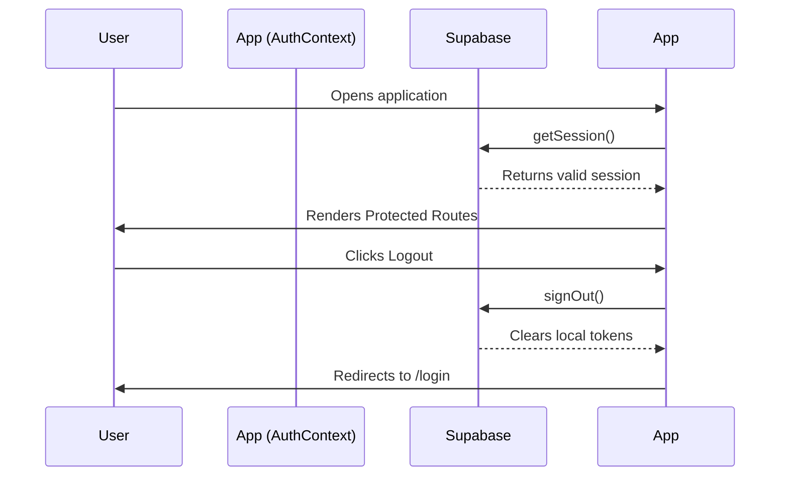

# Authentication

## Overview
LifeGroww uses Supabase Auth for managing user sessions. It supports both standard Email/Password authentication and Google OAuth.

## File: `src/context/AuthContext.tsx`

This context provider wraps the application and exposes the current user state to all child components.

### States
- `user`: Holds the Supabase `User` object or `null` if not authenticated.
- `loading`: A boolean indicating if the initial session check is still ongoing.
- `isConfigured`: A boolean indicating if Supabase environment variables are present.

### Initialization Flow
1. On mount, if Supabase is configured, `supabase.auth.getSession()` is called to retrieve any existing session from local storage.
2. An event listener `supabase.auth.onAuthStateChange` is attached to listen for token refreshes, logins, or logouts in other tabs.
3. The `loading` state is set to `false` once the session check completes, allowing the `ProtectedRoute` wrapper to render its children or redirect.

## Login Flow (`src/pages/Login.tsx`)

### Email/Password
1. User enters email and password.
2. Based on the active tab ("Sign In" vs "Sign Up"), it calls `signInWithPassword` or `signUp`.
3. If successful, Supabase Auth sets the secure cookie/local storage token.
4. `AuthContext` detects the state change via `onAuthStateChange`.
5. User is redirected to `/` (Index).

### Google OAuth
1. Uses `signInWithOAuth({ provider: "google" })`.
2. Redirects the user to the Google login page.
3. Upon successful login, redirects back to the application.
4. Supabase processes the callback URL hash to extract the session token.

### Offline / Missing Config Mode
If `VITE_SUPABASE_URL` or `VITE_SUPABASE_ANON_KEY` are missing, the app enters an "Offline Fallback" mode. The Login page shows a warning and allows the user to click "Continue in Offline Mode", which sets the `user` to `null` but bypasses route guards, allowing the app to function entirely via local storage.

## Diagrams

