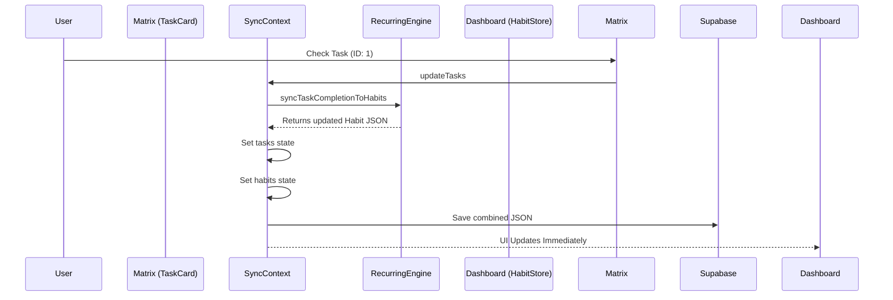

# Recurring Tasks Engine

## Overview
The Recurring Tasks Engine bridges the gap between static tasks in the Eisenhower Matrix and daily actions in the Habit Tracker. It automatically generates tasks based on complex schedules and ensures that checking off a generated task automatically checks off the corresponding habit, and vice versa.

## File Dependencies
- `src/lib/recurring-engine.ts`: Pure functions for calculating occurrences and syncing states.
- `src/components/RecurringConfigDialog.tsx`: The UI for creating a schedule.
- `src/components/RecurringTasksManagerDialog.tsx`: The UI for managing all active schedules.

## Core Logic (`recurring-engine.ts`)

### Configuration Schema (`RecurringConfig`)
Configurations are stored in the global `settings` object.
- `schedule`: `"daily" | "weekly" | "monthly" | "yearly" | "custom"`
- `customValue` & `customUnit`: Allows schedules like "Every 3 Days" or "Every 2 Weeks".

### Task Generation
The function `generateScheduledTasks` handles the creation:
1. It reads all active `RecurringConfigs`.
2. It calculates expected dates (`getOccurrencesUpTo`) from the configuration's `startDate` up to `today`.
3. It scans the `tasks` array. If an expected occurrence does not exist (identified by matching `recurringConfigId` and `recurringDate`), it generates a new task.
4. **Trigger:** This logic runs inside `SyncContext.tsx` within a `useEffect` whenever the app is initialized or the configs change.

### Bidirectional Sync
Because a user might link a Recurring Task to a Habit Tracker item, the system enforces state synchronization:

**Task -> Habit (`syncTaskCompletionToHabits`)**
Triggered inside `SyncContext.updateTasks`. If a user marks a generated task as completed in the Matrix:
1. It identifies the `habitId` from the config.
2. It parses the `recurringDate` into Year, Month, and Day.
3. It updates the `habits.months[YYYY-MM].days[D].checks[habitId]` to true.

**Habit -> Task (`syncHabitCompletionToTasks`)**
Triggered inside `SyncContext.updateHabits`. If a user checks a box in the Dashboard:
1. It identifies if that habit is linked to a recurring config.
2. It finds the specific generated task for that date.
3. It marks the task `completed: true`. If the task doesn't exist yet (e.g., user is looking at a future date), it generates the task on the fly and marks it completed.

## Flow Diagram

