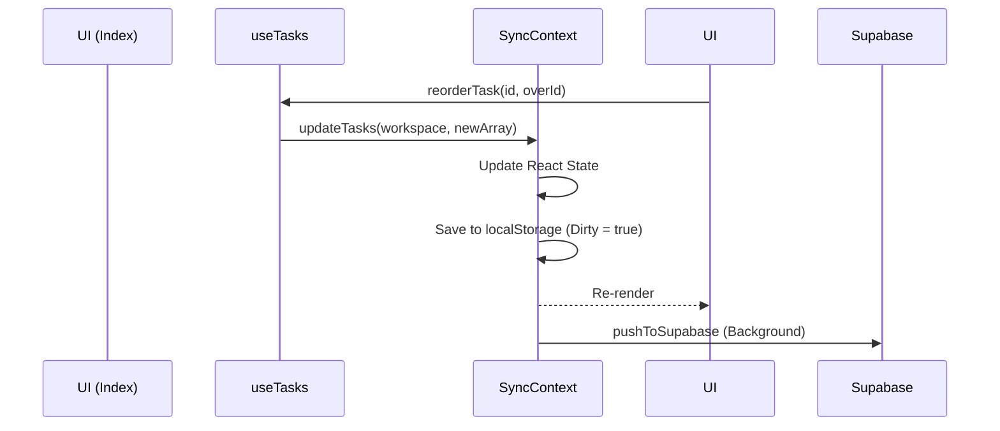

# Task System

## Overview
The task management system is based on the Eisenhower Matrix framework, categorizing tasks into four quadrants based on Urgency and Importance.

## File Dependencies
- `src/hooks/useTasks.ts`: Core state management and business logic for tasks.
- `src/components/TaskCard.tsx`: The UI component representing an individual task.
- `src/pages/Index.tsx`: The main UI view housing the Matrix.

## The Quadrants
```typescript
export type Quadrant = "q1" | "q2" | "q3" | "q4";

// q1: Do (Important & Urgent)
// q2: Schedule (Important, Not Urgent)
// q3: Delegate (Not Important, Urgent)
// q4: Delete (Not Important, Not Urgent)
```

## Hook: `useTasks(workspaceId)`

The `useTasks` hook bridges the global `SyncContext` with local operations. 
It retrieves the array of tasks for the specified workspace (`personal` or `professional`) and provides mutation methods.

### Normalization & Sorting
Tasks are sorted through a `normalize()` function before being returned to the UI:
1. **Overdue Active Tasks:** Sorted by deadline (oldest first).
2. **Standard Active Tasks:** Preserved manual order (drag & drop order).
3. **Completed Tasks:** Moved to the bottom of the list.

### Mutation Methods
- `addTask`: Creates a new UUID, defaults `priority` to `low` and `status` to `pending`.
- `removeTask`: Filters the task out of the array.
- `toggleTask`: Flips the `completed` boolean and updates the status to `done` or `pending`.
- `setTaskStatus`: Explicitly sets `pending`, `in_progress`, or `done`.
- `setTaskDueDate`: Assigns an ISO date string for deadlines.
- `reorderTask`: Modifies the array order to support `@dnd-kit/core` drag-and-drop operations between quadrants or within the same quadrant.

## Component: `TaskCard.tsx`
Provides the UI for interacting with a task.
- **Checkbox:** Toggles completion and plays a sound (`playCompleteSound()`).
- **Drag Handle:** Uses `useSortable` to allow moving tasks between quadrants.
- **Inline Editing:** Clicking the pencil icon swaps the label for an input field.
- **Deadline popover:** Uses `<input type="datetime-local">` to set specific deadlines.
- **Overdue formatting:** If `new Date(task.dueDate) < Date.now()` and it is not completed, it is styled with a red warning background.

## Data Flow

